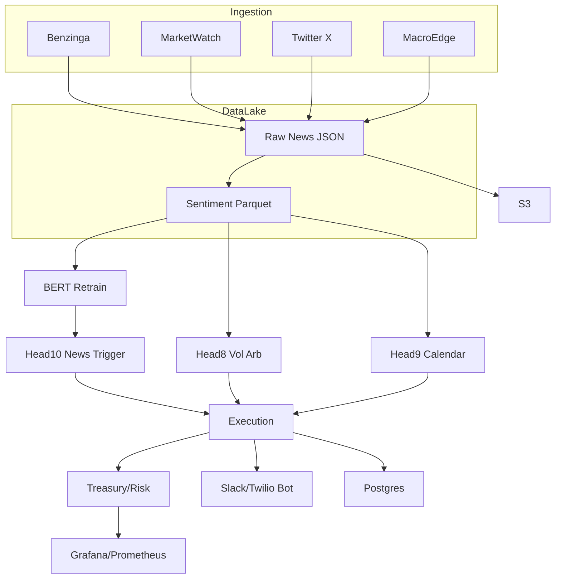

# FinRL Platform v2.1.0

## Quick Start

### Prerequisites
- Docker, docker-compose, or k3s/k8s cluster
- Python 3.10 (for local dev)
- Redis, Postgres, S3, Slack, Twilio, and GitHub credentials in `.env`

### Local (Docker Compose)
```sh
git clone https://github.com/clearpeakegroup/finrl-platform.git
cd finrl-platform
cp .env.example .env  # Fill in secrets
make build
make up
# Or: docker-compose up --build
```

### Kubernetes (k3s/ArgoRollouts)
```sh
cd infra
kubectl apply -f k3s-redis.yaml
kubectl apply -f k3s-postgres.yaml
kubectl apply -f k3s-api.yaml
kubectl apply -f k3s-worker.yaml
```

### Run Tests
```sh
pytest -q
```

## Architecture Diagram


## Key Features
- Async news ingest (Benzinga, MarketWatch, Twitter X, MacroEdge)
- 60s sentiment parquet pipeline (zstd, pyarrow)
- Quantized MiniLM BERT retrain, nightly S3/GitHub tag
- Three production strategy heads (vol arb, calendar, news-triggered)
- Multi-GPU, k3s/ArgoRollouts, HPA, DR
- Risk/treasury module, Grafana dashboards, Slack/Twilio ops bot

## For full details, see infra/README.md and code comments.

## Overview
A modular, extensible research and execution platform for advanced trading strategies, with a focus on microstructure, event-driven, and quantitative methods. Supports rapid strategy development, backtesting, and deployment.

## Features
- Modular strategy architecture (plug-and-play)
- Real-time and historical (replay) data ingestion
- Simulated and broker execution layers
- Centralized configuration management
- Structured logging and monitoring
- Pytest-based unit and integration tests
- CLI runner for strategy orchestration

## Directory Structure
```
trader-core/
  strategies/         # Strategy implementations
  data_connectors.py  # Data ingestion modules
  execution.py        # Execution layer
  runner.py           # Orchestration/runner
  config_loader.py    # Config loader
config/
  default.yml         # Default configuration
  logging.yml         # Logging configuration
utils/                # Utilities (e.g., orderbook)
tests/                # Unit and integration tests
README.md             # This file
```

## Setup
1. **Install dependencies:**
   ```bash
   pip install -r backend/requirements.txt
   ```
2. **Configure:**
   - Edit `config/default.yml` for strategy and data parameters.
   - Edit `config/logging.yml` for logging preferences.

## Usage
Run a strategy with the CLI runner:
```bash
python trader-core/runner.py \
  --strategy Head8IcebergAbsorptionStrategy \
  --module trader_core.strategies.options.head8_iceberg_absorption \
  --connector live \
  --symbol ES \
  --execution sim
```
For PCAP/CSV replay:
```bash
python trader-core/runner.py \
  --strategy Head8IcebergAbsorptionStrategy \
  --module trader_core.strategies.options.head8_iceberg_absorption \
  --connector pcap \
  --pcap path/to/sample.csv \
  --execution sim
```

## Testing
Run all tests:
```bash
pytest tests/
```

## Documentation
- All public classes and methods are documented with docstrings.
- (Optional) API docs can be generated with Sphinx or MkDocs.

## Extending
- Add new strategies in `trader-core/strategies/options/` or `fut_only/`.
- Implement new data connectors or execution interfaces as needed.

## License
MIT License

## Job & Ops API

### Launch a back-test job
```bash
curl -X POST http://localhost:8000/jobs/train -H 'Content-Type: application/json' -d '{"type": "train", "params": {"symbol": "AAPL", "epochs": 10}}'
```

### Launch a forward-test job
```bash
curl -X POST http://localhost:8000/jobs/forward -H 'Content-Type: application/json' -d '{"type": "forward", "params": {"symbol": "AAPL", "window": 5}}'
```

### Launch a live trading job
```bash
curl -X POST http://localhost:8000/jobs/live -H 'Content-Type: application/json' -d '{"type": "live", "params": {"symbol": "AAPL", "capital": 10000}}'
```

### Pause, resume, or cancel a job
```bash
curl -X PATCH http://localhost:8000/jobs/<job_id> -H 'Content-Type: application/json' -d '{"action": "pause"}'
curl -X PATCH http://localhost:8000/jobs/<job_id> -H 'Content-Type: application/json' -d '{"action": "resume"}'
curl -X PATCH http://localhost:8000/jobs/<job_id> -H 'Content-Type: application/json' -d '{"action": "cancel"}'
```

### Get job metadata and progress
```bash
curl http://localhost:8000/jobs/<job_id>
```

### Stream job progress (SSE)
```bash
curl http://localhost:8000/jobs/<job_id>/stream
```

### Get mock account info
```bash
curl http://localhost:8000/account
```

### Health check
```bash
curl http://localhost:8000/health
```

## Risk Management

The platform provides a live risk management system with:
- **Risk Tab in UI**: Adjust VaR-99% and Margin caps (5–40%) with instant effect. If set above 25%, you must acknowledge the risk.
- **API Endpoints**:
  - `POST /settings/risk` — Set risk/margin caps. Requires `ack_high=true` for >25%.
  - `GET /settings/risk` — Get current risk/margin settings.
- **Auto-Reset**: Caps reset to 10%/11% 15 minutes before CME settle each day.
- **Safety**: Hard-coded 40% ceiling, Slack warning for >25%, and `/kill all` flattens all positions.
- **Latency**: All changes propagate to the engine within 100ms.

### Usage
- Use the Risk tab sliders to set your desired caps. If you exceed 25%, tick the checkbox to confirm.
- Click Apply. Success or error will be shown instantly.
- The backend and engine will update risk/margin limits live. At 15 minutes before settle, sliders snap back to default.
